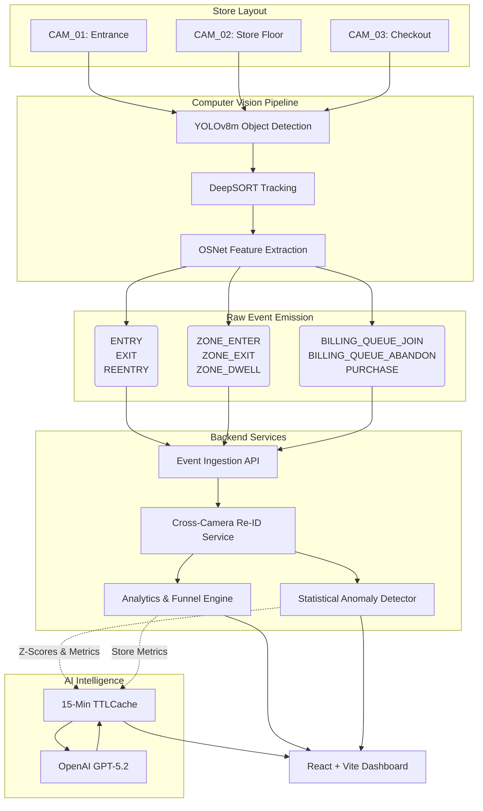
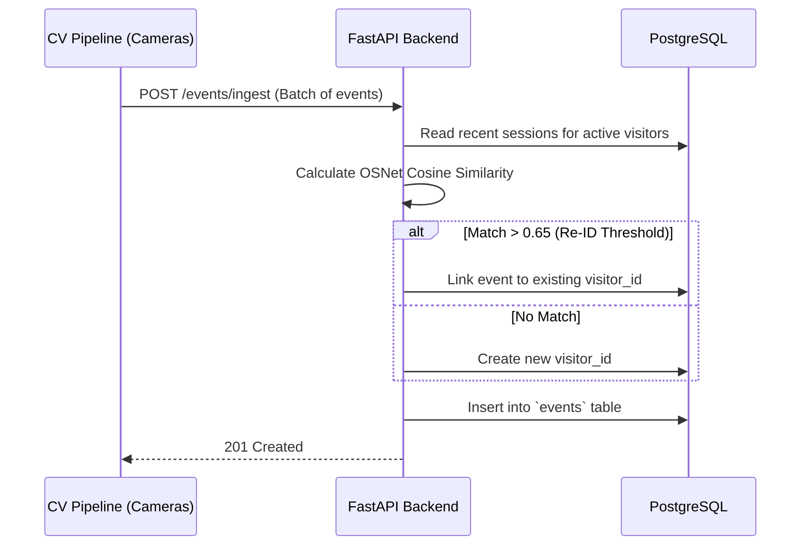
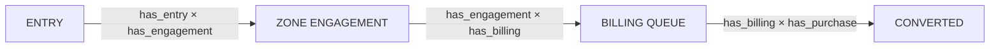
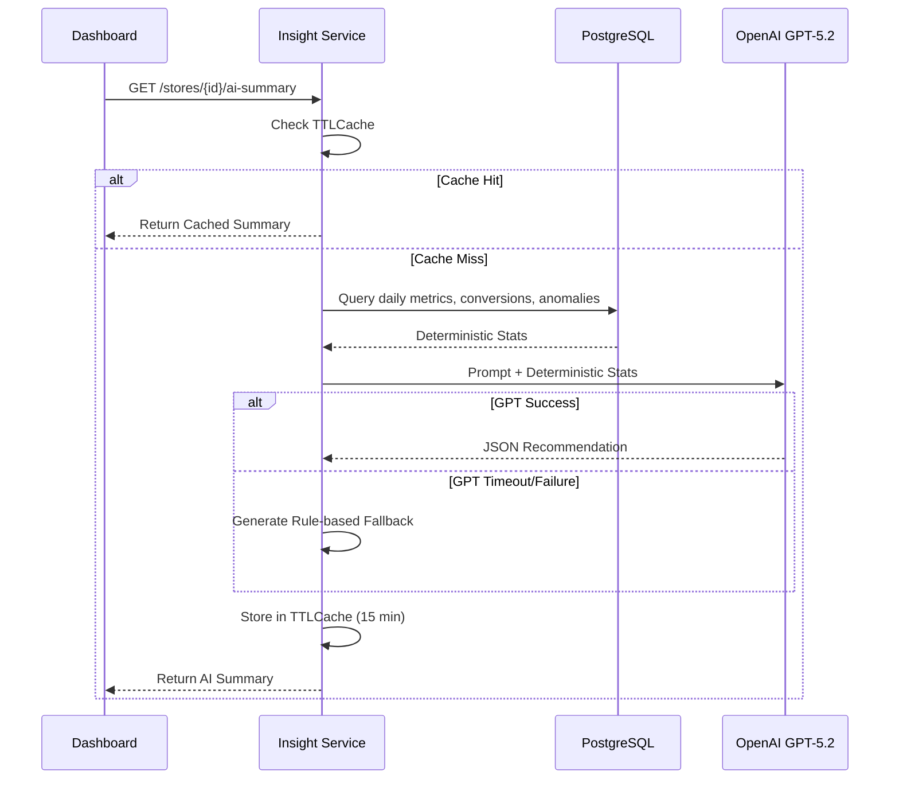

# System Architecture: VisionRetail AI

## High-Level Architecture Flow

## Data Model & Component Interaction

### 1. Data Ingestion Sequence

### 2. Funnel Analytics Logic
The system enforces strict retail funnel hierarchy through a mathematical boolean CTE applied at query time.

### 3. AI Copilot / Insights Flow

